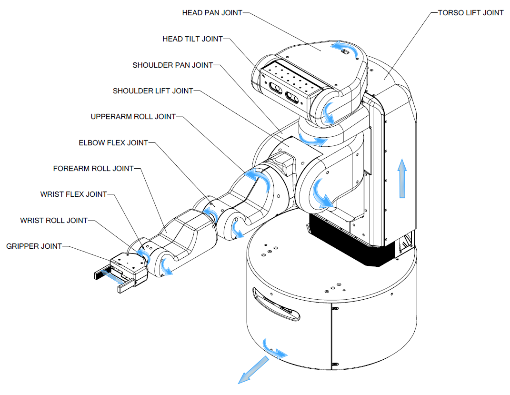

UBR-1 Overview
==============

This section details the key components of UBR-1, including the kinematics,
sensors and software.

Kinematics
----------

UBR-1 is a 13-dof mobile manipulator with a mobile base, arm, gripper,
and pan-tilt head.

Terminology
+++++++++++

The robot kinematics can be described using the concepts of joints,
links, and frames. Each of these is defined and represented in code,
as well as having a unique name. In general, a single joint will have
an actuator and a transmission and will connect two links together. A
link is a rigid body in the kinematic tree, and will have a coordinate
frame, but not all frames are associated with links.  There are also
"fixed" joints, so some rigid bodies that could be considered one link
are considered to be two links rigidly joined together.  This is done
mostly at locations where there is a physical interface between
components.

 * Link
    A link is a rigid body within the robot.  It generally has
    geometry to define visual and collision-space representations, has
    inertial properties, and has a name.  The links for the UBR-1 are
    defined in the "URDF" description that can be found in the
    ubr1_description package.
 * Frame
    Frames are geometric entities that represent coordinate
    frames in space.  Every link has an associated frame, but we also
    use frames to represent other things, such as the optical frame of
    a camera, the global map, or the location of a detected
    object. Frames are always defined relative to one another, and
    relationships and transformations between them are tracked using
    the `tf <http://wiki.ros.org/tf>`_ package.
 * Joint 
    Joints are considered part of the robot, and define the
    relationship between links.  The joints for the UBR-1 are defined
    in the URDF description that can be found in the ubr1_description
    package.  The UBR-1 has mostly rotational joints, but the torso
    and gripper translational, and there are also a number of "fixed"
    joints used to represent the notion that two links are part of the
    same rigid body.  Rotational and translational joints are
    generally represented in the same way in the system, and we refer
    to joint "effort" instead of force or torque, as well as using
    position, and velocity to represent both linear and angular
    movement.

In general, the names for a link and the associated frame will be
similar (e.g. forearm_link and forearm_frame), and the names the
associated joint will be similar (e.g elbow_flex_joint).

.. figure:: images/urdf_links.png
   :width: 100%
   :align: center
   :figclass: align-centered

   **Figure 1:** UBR-1 link names.

   **Figure 2:** UBR-1 joint names and direction of positive motion.

Home Pose 
+++++++++

In order to describe the UBR-1 robot pose and joint positions in a
consistent manner, a **home pose** of the robot has been defined.  At
the home pose, all joint-angles are considered to be at zero.  In the
home pose the arm is straight ahead in front of the body, the gripper
is closed, and the head is centered and level.

UBR-1 Coordinate System
-----------------------

The coordinate frames for all links of the UBR-1 are defined to be
aligned with a world coordinate frame of positive z-axis up, positive
x-axis forward, and positive y-axis robot-left when the UBR-1 is in
the home pose. All joint angle conventions are chosen so that at the
home position, positive motion of the joint causes positive motion
around one of the positive axes of the joint coordinate system, as
shown in Figure 2.

Sensors
-------

This robot has a lot of sensors. They measure things, like awesomness.

 - joint measurements
 - head camera
 - base laser
 - imu in base
 - imu in gripper
 - awesome sensor

Software
--------

TODO: link to ROS.org for the various tools
UBR-1 is controlled through the Robot Operating System (ROS). ROS offers a
number of capabilities that ease robot application development. These include
things like a build system, command line tools (rostopic), visual tools (rviz),
tutorials, and robot related software for things like processing camera data
(opencv) or solving kinematics problems (orocos-kdl). However, the single
greatest thing that ROS offers, is a large community and standard interfaces
so that developers can share code. UBR-1 implements these standard interfaces:

TODO: for each of these, link to appropriate section of docs here on wiki (for
the robot component) and on ROS.org (for the message type).

 - The base is controlled through a geometry_msgs/Twist
 - The arm is controlled via control_msgs/FollowJointTrajectoryAction
 - The head can be controlled through the joint trajectory action, or via a
   control_msgs/PointHeadAction
 - The gripper uses a control_msgs/GripperAction
 - The head camera outputs sensor_msgs/Image and sensor_msgs/PointCloud2 topics.
 - The base laser outputs sensor_msgs/LaserScan topics.
 - The IMUs output sensor_msgs/Imu topics.

Since ROS developers can use standard interfaces, they can easily release code
for a broader community to try. ROS consists of many software packages, most of
which are listed on the ROS.org wiki.
