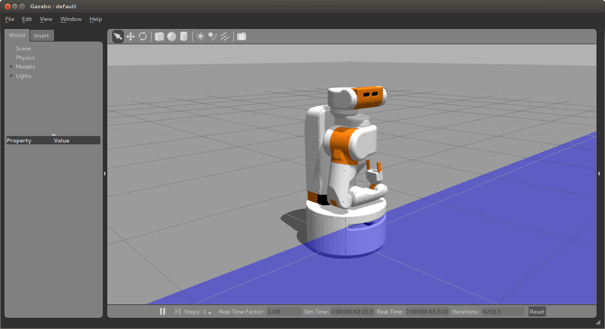
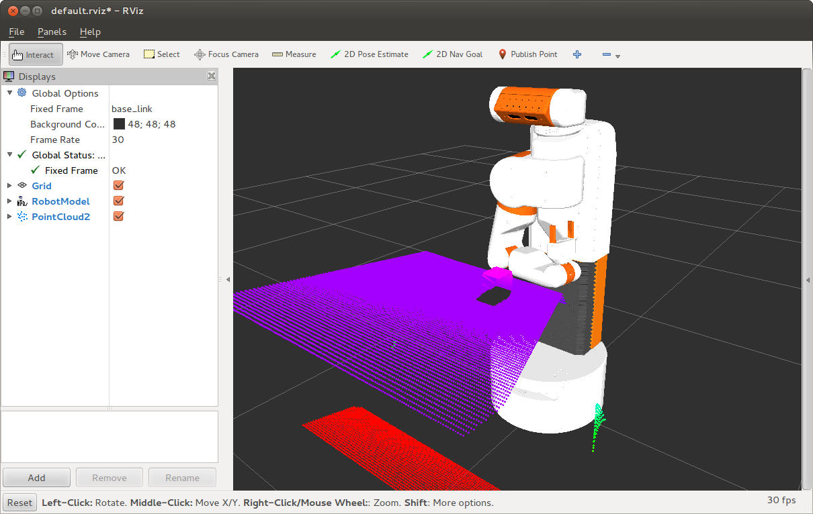

Simulating the UBR-1
====================

Unbounded Robotics has created a simulation environment for the UBR-1 built on
the open source simulator `Gazebo <http://gazebosim.org>`_. This simulator
allows you to test certain pieces of code even when you do not have access to
a robot, or before running certain code on the actual robot.

It should be noted that this is a simulation, and is certainly not a perfect
model of the world or the robot. Results between real world and simulation may
vary wildly at times. Be sure to also note the limitations and differences
of the simulated UBR-1 which are listed at the bottom of this page.

Starting the Simulator
----------------------

To start the simulator, you will run one of several roslaunch files. Each roslaunch file
brings up a different environment. The simplest environment is started by running:

::

    >$ roslaunch ubr1_gazebo simulation.launch

This environment includes nothing except a robot and the floor. In every environment,
the robot will be initialized with the arm tucked and the head pointing forward:

There are several other environments:

 * ``simulation_home.launch`` brings up a small "home" with an environment designed to be
   similar to the RoboCup\@Home competition environment.
 * ``simulation_grasping.launch`` brings up a table with some cubes on it for trying out
   manipulation.

Connecting with RVIZ
--------------------

Once your simulator is up and running, you probably want to connect with RVIZ to see
what is going on in more detail. In a new terminal, run the following:

::

    >$ rosrun rviz rviz

To setup RVIZ to show the relevant topics, there are a set of config files that can
be loaded when running various apps. Under "File | Open Config" you can navigate to
the **ubr1_gazebo** package, and in the **config** folder you will find a **default.rviz**
file which will setup RVIZ to look like this when running the grasping world:

Teleoperating the Simulated UBR-1
---------------------------------

The **ubr_teleop** package includes a number of scripts for commanding the robot
to move its joints in certain ways. The first thing you probably want to do is
drive the robot around. The **keyboard_telop** node allows you to do this:

::

    >$ rosrun ubr_teleop keyboard_teleop
    Reading from keyboard
    -------------------------
    Use 'WASD' to translate
    Use arrow keys to move head
    Any other key to stop

Now, if you press the 'w' key, the robot will drive forward. Hitting any key other
than WASD or arrows will stop the robot. 'a' turns left, 's' right.

There is a script for controlling the torso, called **set_torso_pose.py** that takes
a single parameter, the height of the torso in meters. The torso has a range of 0 to
about 0.35m:

::

    >$ rosrun ubr_teleop set_torso_pose.py 0.135
    [INFO] [WallTime: 1402534422.712588] [0.000000] Waiting for torso_controller...
    [INFO] [WallTime: 1402534422.925660] [1050.681000] ...connected.
    [INFO] [WallTime: 1402534422.926222] [1050.681000] Setting torso pose to 0.350000
    [INFO] [WallTime: 1402534430.001018] [1057.705000] ...done

Similarly, the gripper can be controlled between open (0.09m) and closed (0.0m) using
either a distance or the word "open" or "closed":

::

    >$ rosrun ubr_teleop set_gripper_pose.py open
    [INFO] [WallTime: 1402534358.090159] [0.000000] Waiting for gripper_controller...
    [INFO] [WallTime: 1402534358.337175] [986.410000] ...connected
    [INFO] [WallTime: 1402534358.337896] [986.410000] Setting gripper pose to 0.090000
    [INFO] [WallTime: 1402534358.339674] [986.414000] Results:
    position: 0.0899971663187
    effort: 0.00567451527058
    stalled: False
    reached_goal: True

A final script, called **set_head_pose.py** will allow you to set the head pan
and tilt:

::

    >$ rosrun ubr_teleop set_head_pose.py 0 0.1

Will set the head pan to 0 (forward), and tilt to 0.1 (slightly upward). 

One thing to note is how the topics of the mobile base teleop are connected.
The **keyboard_teleop**
node publishes to a topic called ``teleop/cmd_vel``. However, the mobile base
gets it's commands from ``base_controller/command``, and most applications will (such
as navigation) will publish their commands to ``cmd_vel``. The key is a topic multiplexor
that forwards ``cmd_vel`` to ``base_controller/command`` by default, but whenever the
you start pressing keys in **keyboard_teleop** the multiplexor will override ``cmd_vel``
with the values sent to ``teleop/cmd_vel``.

Differences and Limitations
---------------------------

The simulated robot is not exactly the same as the real robot. Notable differences
include:

 * The simulator does not simulate the IMUs at this time. Additionally, because there
   is no IMU data, the odom_combined tf frame is created only by using odometry. On
   the real robot, odometry is fused with the IMU using `Graft <http://wiki.ros.org/graft>`_.
 * The **head_camera/depth/*** topics do not exist due to a current limitation with the
   gazebo_ros interface.
 * The robot may eventually wander away when sitting still due to accumulated error in the
   simulation. Rest assured, the real robot will not wander off unless you command it to do so.

